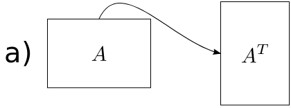
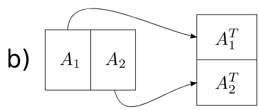
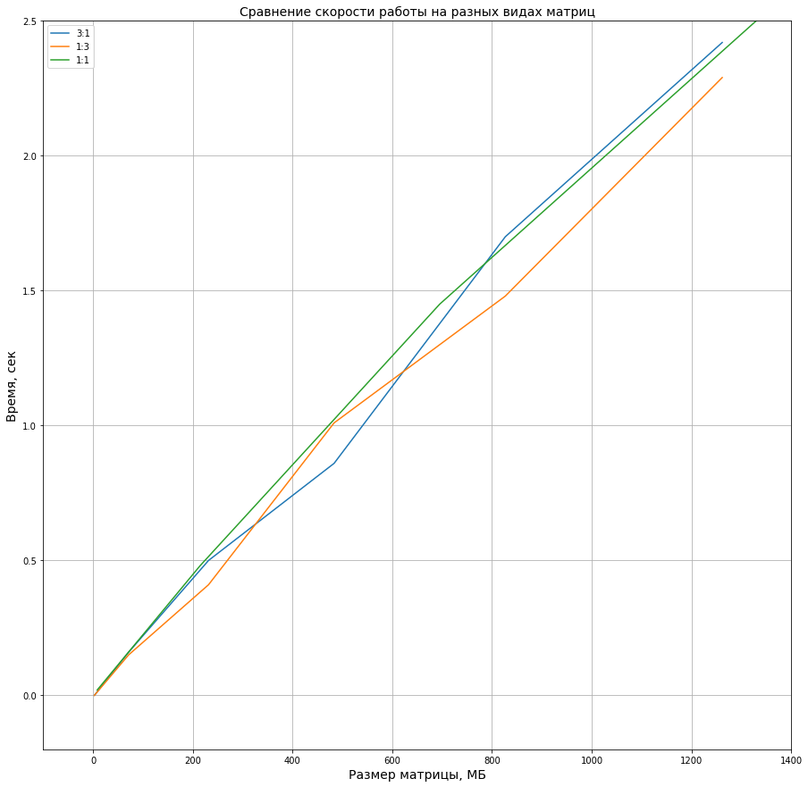
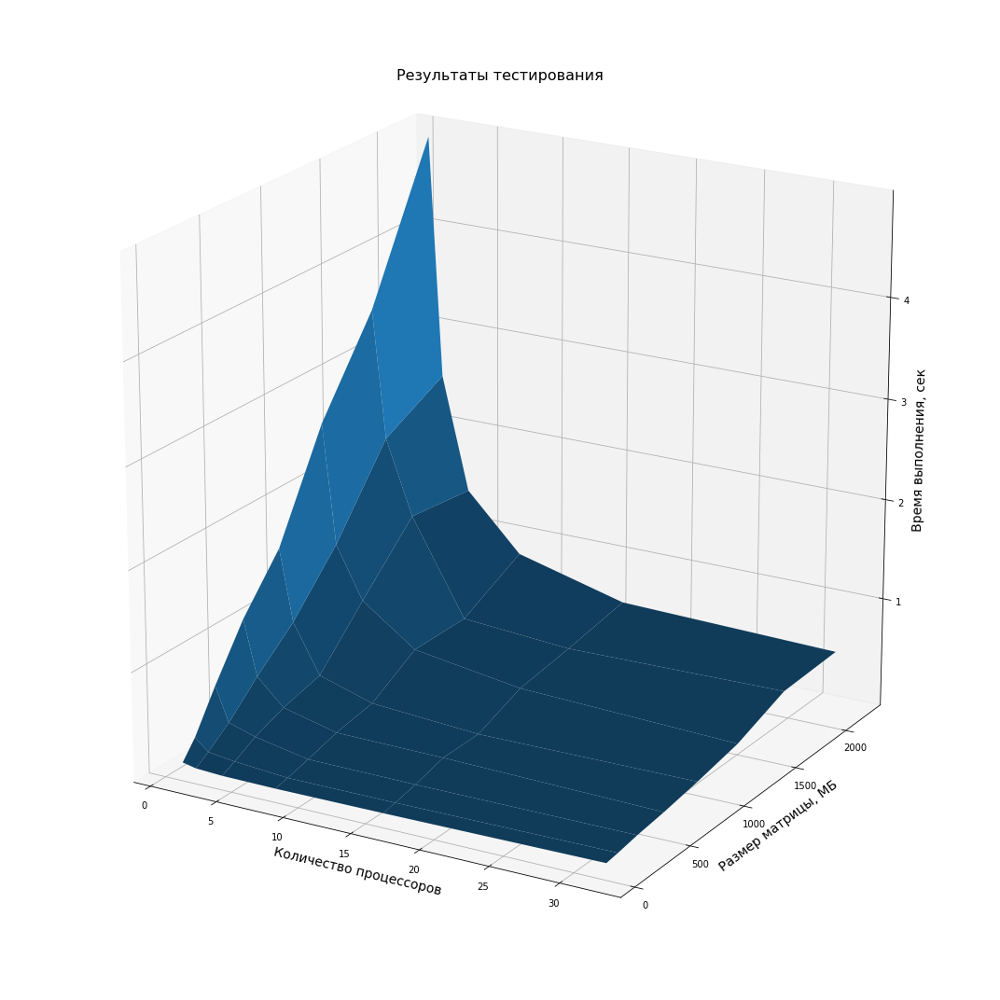
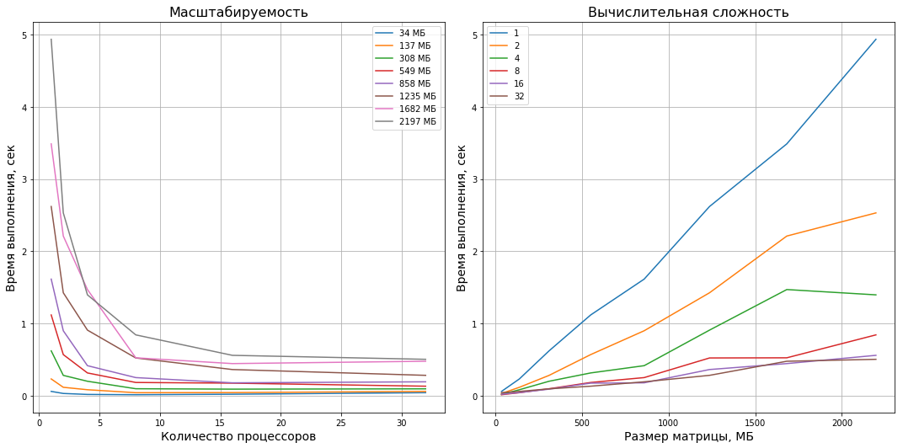
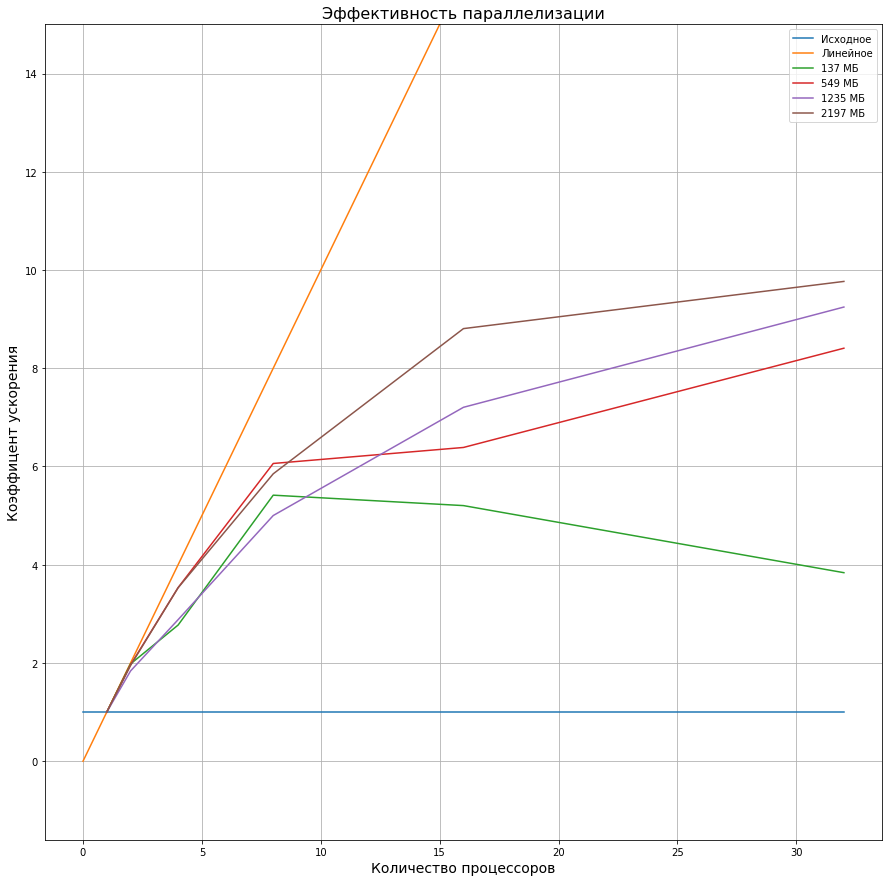

Разработка параллельной версии программы для транспонирования матриц
=====================================================================

##Содержание
[TOC]

##Требования
* Реализовать параллельную версию программы для транспонирования матриц с использованием технологий `OpenMP` и `MPI`
* Протестировать программу на суперкомпьютере IBM Blue Gene или IBM Polus
* Исследовать масштабируемость полученной параллельной программы
* Сравнить эффективность `OpenMP` и `MPI` версий программы

##Реализация
####Алгоритм
Простой алгоритм транспонирования является неэффективным с точки зрения кэша процессора. 
При больших размерах матрицы, расстояние в памяти между соседними элементами по столбцам составляет длина строки, а несколько строк может не вмещаться в кэш.

Для эффективного использования кэша исходная матрица рекурсивно разбивается на блоки, пока все полученные блоки не будут меньше заранее заданного размера. 
Затем, для каждого блока независимо выполняется транспонирование стандартным способом. При транспонировании чтение исходной матрицы проводится по столбцам, а запись в матрицу назначения по строкам.




[https://en.wikipedia.org/wiki/Cache-oblivious_algorithm](https://en.wikipedia.org/wiki/Cache-oblivious_algorithm)

####OpenMP
Для параллелизации с помощью `OpenMP` использовались директивы `parallel`, `single`, `task`, `taskwait` и клауза `shared`. 
В управляющей функции перед запуском рекурсии, с помощью директивы `parallel` инициализируются потоки.
Чтобы первая итерация рекурсии выполнялась одним потоком, используется директива `single`. 
Каждый последующий рекурсивный вызов функции выполняется в отдельной независимой задаче, выделенной директивой `task` c клаузой `shared`, которая используется для использования одного общего объекта класса Matrix во всех потоках. 
В конце управляющей функции находится директива `taskwait`, чтобы дождаться окончания всех задач.

Время замеряется функцией `omp_get_wtime`. Количество нитей совпадает с количеством процессоров.

####Архитектура
Программа написана на языке C++. Каждая версия алгоритма транспонирования находится в отдельном `.cpp` файле в виде функции «друга» для класса Matrix.

[main.cpp](#maincpp)
: Единый файл для запуска тестов. Через параметры командной строки принимает размеры матрицы и количество нитей. По окончанию работы пишет в стандартный поток ошибок данные в формате `csv`. Стандартный поток ошибок выбран для сохранения результатов вместо стандартного потока вывода в связи с особенностью команды bsub: по окончанию задачи в стандартный поток вывода пишется отладочная информация.
Версия программы выбирается на этапе компоновки. Запуск теста производится через функцию `transpose_test`, которая возврщает время выполнения алгоритма в секундах.

[Matrix.h](#matrixh)
: Содержит класс Matrix для удобной работы с матрицами. Конструктор и деструктор позволяют скрыть выделение и освобождение памяти. Перегруженный оператор `()` упрощает индексацию матрицы.

[transpose_regular.cpp](#transpose_regularcpp)
: Версия без параллелизации.

[transpose_openmp.cpp](#transpose_openmpcpp)
: Версия программы, распараллеленная с помощью `OpenMP`.

[Makefile](#maincpp)
: Скрипт для сборки программ. Доступные команды:

* `make test_regular` -- собрать версию без параллелизации
* `make test_openmp` -- собрать версию с `OpenMP`
* `make all` -- собрать все доступные версии программы
* `make clean` -- очистить рабочую директорию

[run_tests.sh](#run_testssh)
: Скрипт для запуска тестов. Через параметры командной строки получает команду для тестирования, размер стороны матрицы, максимальное количество процессоров и путь к csv файлу для сохранения результатов.

##Тестирование
####Тестировочные данные
Матрицы:

* Тип данных -- `char`
* Размеры -- 34-2197 МБ
* Соотношение сторон: 1:1
* Значения -- `i - j`

####Платформа
Тестирование проводиться на вычислительном комплексе IBM Polus факультета ВМК МГУ.

####Процесс
Каждый тест проводиться 5 раз и из полученных данных берется медиана. Для каждого теста запускается отдельная задача с помощью команды bsub. Тесты запускаются с 1, 2, 4, 8, 16 и 32 процессорами.

##Результаты
####Без параллелизации
Была проверена зависимость скорости работы алгоритма от формата матрицы. Замечено, что рост времени от общего размера для всех трех форматов эквивалентен. В дальнейшем для тестирования будут использоваться только квадратные матрицы.


####OpenMP


Время выполнения программы зависит обратно пропорционально от количества процессоров и прямо пропорционально от размера матрицы.
Начиная с 8 процессоров, время выполнения изменяется незначительно.

На графике масштабируемости заметно схождение времени к числу, зависящему от размера матрицы. Это накладные расходы на рекурсивный запуск задач.


На малых размерах матриц и большом количестве процессоров накладные расходы значительно ухудшают скорость выполнения программы.
Заметно резкое понижение эффективности увеличения количества процессоров после 8.


##Код программы
####Makefile
```make
.PHONY: all clean

all: test_regular test_openmp

clean:
    rm test_regular test_openmp

test_regular: main.cpp transpose_regular.cpp Matrix.h
    ${CXX} -std=c++11 -O3 -o test_regular main.cpp transpose_regular.cpp

test_openmp: main.cpp transpose_openmp.cpp Matrix.h
    ${CXX} -std=c++11 -O3 -fopenmp -o test_openmp main.cpp transpose_openmp.cpp
```

####run_tests.sh
```bash
#!/bin/bash

command=$1
side=$2
max_threads=$3
output_file=$4

for (( i = 0; i < 5; i++ ))
do
    for (( num_threads = 1; num_threads <= max_threads; num_threads *= 2 ))
    do
        bsub -n ${num_threads} -W 1 -e ${output_file} ${command} ${side} ${side} ${num_threads}
    done
done
```

####Matrix.h<br>
```c++
#include <cstddef>

// Class for matrix representation
// It have immutable sizes for performance reasons
template <typename T>
class Matrix {
    T* ptr;
    size_t _rows;
    size_t _cols;
public:
    T& operator()(size_t i, size_t j) {
        return ptr[i * _cols + j];
    }

    const T& operator()(size_t i, size_t j) const {
        return ptr[i * _cols + j];
    }

    // Initialize matrix with i-j values, where i is row and j is column
    Matrix(size_t rows, size_t cols) :
        ptr(new T[rows * cols]),
        _rows(rows), _cols(cols) {
    
        for (int i = 0; i < rows; i++) {
            for (int j = 0; j < cols; j++) {
                (*this)(i, j) = i - j;
            }
        }
    }

    Matrix(const Matrix&) = delete;

    ~Matrix() {
        delete [] ptr;
    }

    size_t rows() const {
        return _rows;
    }

    size_t cols() const {
        return _cols;
    }


    // Perform matrix out-place transpose regular way
    // Used for correctnes tests
    friend
    void transpose(const Matrix<T>& src, Matrix<T>& dst) {
        for (int j = 0; j < src.cols(); j++) {
            for (int i = 0; i < src.rows(); i++) {
                dst(j, i) = src(i, j);
            }
        }
    }

    friend
    bool operator==(const Matrix& mat1, const Matrix& mat2) {
        for (size_t i = 0; i < mat1.rows(); i++) {
            for (size_t j = 0; j < mat1.cols(); j++) {
                if (mat1(i, j) != mat2(i, j)) return false;
            }
        }
        return true;
    }
};
```
####main.cpp
```c++
#include <iostream>
#include <omp.h>

#include "Matrix.h"

// Calls transposition method from linked library on char matrix
// Returns time with respect to multi-threading
double transpose_test(const Matrix<char>& src, Matrix<char>& dst, size_t num_threads);

int main(int argc, char** argv) {
    // Turn off sync with stdio for performance reasons
    std::ios::sync_with_stdio(false);

    if (argc != 4) {
        std::cout << "Incorrect usage\n"
                  << "\t" << argv[0] << " rows cols num_threads"
                  << std::endl;
        return 1;
    }

    // Get matrix size
    const size_t rows = strtoul(argv[1], nullptr, 10);
    const size_t cols = strtoul(argv[2], nullptr, 10);
    const size_t num_threads = strtoul(argv[3], nullptr, 10);
    if (rows == 0 || cols == 0) {
        std::cout << "Incorrect matrix size" << std::endl;
        return 2;
    }

    // Init matrices
    Matrix<char> mat1(rows, cols);
    Matrix<char> mat2(cols, rows);

    // Print data to csv
    // num_threads, rows, cols, elapsed_time
    std::cerr << num_threads << ',' << rows << ',' << cols << ',' << elapsed_time << std::endl;
}
```

####transpose_regular.cpp
```c++
#include <ctime>

#include "Matrix.h"


// Implementation of recursive transposition
// Splits until threshold block size reached and then performs transposition of sub-matrix
template <typename T, size_t BLOCK_ROWS, size_t BLOCK_COLS>
void _transpose_recursive(const Matrix<T>& src, Matrix<T>& dst,
                          const size_t i_shift, const size_t j_shift,
                          const size_t rows, const size_t cols) {

    // If sub-matrix is big, divide it on biggest dimension by half
    // Else transpose it
    if (rows > BLOCK_ROWS || cols > BLOCK_COLS) {

        if (rows > cols) {
            const size_t half_rows = rows / 2;
            _transpose_recursive<T, BLOCK_ROWS, BLOCK_COLS>(src, dst, i_shift, j_shift, half_rows, cols);
            _transpose_recursive<T, BLOCK_ROWS, BLOCK_COLS>(src, dst, i_shift + half_rows, j_shift, rows - half_rows, cols);
        } else {
            const size_t half_cols = cols / 2;
            _transpose_recursive<T, BLOCK_ROWS, BLOCK_COLS>(src, dst, i_shift, j_shift, rows, half_cols);
            _transpose_recursive<T, BLOCK_ROWS, BLOCK_COLS>(src, dst, i_shift, j_shift + half_cols, rows, cols - half_cols);
        }

    } else {

        // Regular transpose for block
        for (size_t j = j_shift; j < j_shift + cols; j++) {
            for (size_t i = i_shift; i < i_shift + rows; i++) {
                dst(j, i) = src(i, j);
            }
        }

    }
}

// Perform matrix out-place transpose recursive way<br>
// More cache-friendly compared to regular
template <typename T, size_t BLOCK_ROWS = 16, size_t BLOCK_COLS = 16> inline
void transpose_recursive(const Matrix<T>& src, Matrix<T>& dst) {
    _transpose_recursive<T, BLOCK_ROWS, BLOCK_COLS>(src, dst, 0, 0, src.rows(), src.cols());
}

double transpose_test(const Matrix<char>& src, Matrix<char>& dst, size_t num_threads) {
    const auto start_clock = clock();
    transpose_recursive<char, 16, 16>(src, dst);
    const auto end_clock = clock();

    return double(end_clock - start_clock) / CLOCKS_PER_SEC;
}
```

####transpose_openmp.cpp
```c++
#include <omp.h>

#include "Matrix.h"


// Implementation of recursive transposition
// Splits until threshold block size reached and then performs transposition of sub-matrix
template <typename T, size_t BLOCK_ROWS, size_t BLOCK_COLS>
void _transpose_recursive(const Matrix<T>& src, Matrix<T>& dst,
                          const size_t i_shift, const size_t j_shift,
                          const size_t rows, const size_t cols) {

    // If sub-matrix is big, divide it on biggest dimension by half
    // Else transpose it
    if (rows > BLOCK_ROWS || cols > BLOCK_COLS) {

        if (rows > cols) {
            const size_t half_rows = rows / 2;
            #pragma omp task shared(src, dst)
            {
                _transpose_recursive<T, BLOCK_ROWS, BLOCK_COLS>(src, dst,
                                                                i_shift, j_shift,
                                                                half_rows, cols);
            }
            #pragma omp task shared(src, dst)
            {
                _transpose_recursive<T, BLOCK_ROWS, BLOCK_COLS>(src, dst,
                                                                i_shift + half_rows, j_shift,
                                                                rows - half_rows, cols);
            }
        } else {
            const size_t half_cols = cols / 2;
            #pragma omp task shared(src, dst)
            {
                _transpose_recursive<T, BLOCK_ROWS, BLOCK_COLS>(src, dst,
                                                                i_shift, j_shift,
                                                                rows, half_cols);
            }
            #pragma omp task shared(src, dst)
            {
                _transpose_recursive<T, BLOCK_ROWS, BLOCK_COLS>(src, dst,
                                                                i_shift, j_shift + half_cols,
                                                                rows, cols - half_cols);
            }
        }

    } else {

        // Regular transpose for block
        for (size_t j = j_shift; j < j_shift + cols; j++) {
            for (size_t i = i_shift; i < i_shift + rows; i++) {
                dst(j, i) = src(i, j);
            }
        }

    }
}

// Perform matrix out-place transpose recursive way
// More cache-friendly compared to regular
// Improved by OpenMP
template <typename T, size_t BLOCK_ROWS = 16, size_t BLOCK_COLS = 16> inline
void transpose_openmp(const Matrix<T>& src, Matrix<T>& dst) {
    #pragma omp parallel
    #pragma omp single
    _transpose_recursive<T, BLOCK_ROWS, BLOCK_COLS>(src, dst, 0, 0, src.rows(), src.cols());
    #pragma omp taskwait
}

double transpose_test(const Matrix<char>& src, Matrix<char>& dst, size_t num_threads) {
    omp_set_num_threads(num_threads);
    const double start_time = omp_get_wtime();
    transpose_openmp<char, 32, 32>(src, dst);
    const double end_time = omp_get_wtime();

    return end_time - start_time;
}
```
